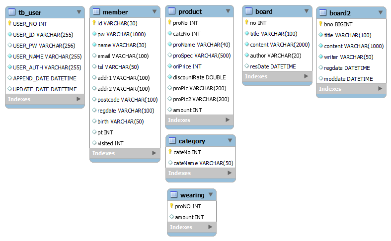
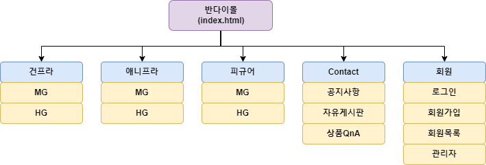
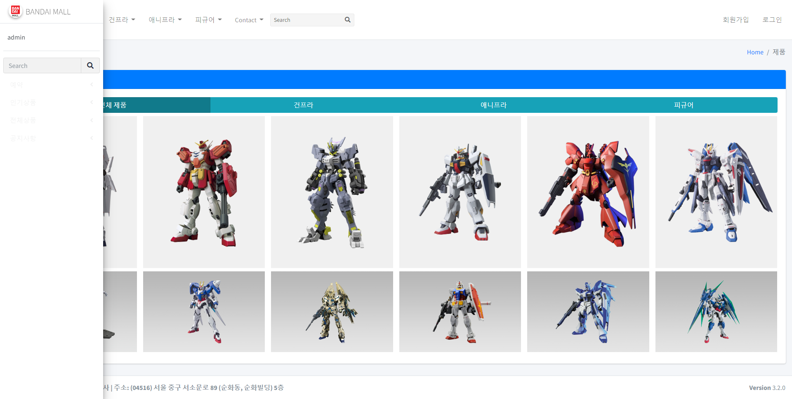
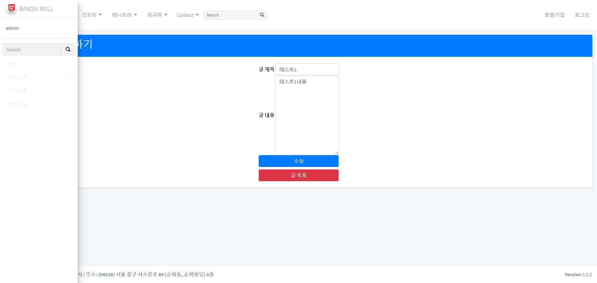

# SpringBoot Project

### 📢 프로젝트 설명
- 개인프로젝트 
    - SpringBoot를 활용한 쇼핑몰 프로젝트 입니다.
- 구현 목표 
    - 사용자 : [조회, 장바구니, 결제]
    - 판매자(관리자) : [물품등록, 재고확인, 물품판매]

### ⚙ 개발 환경
- 운영체제 : Windows-11
- 통합개발환경(IDE) : Intellij, STS
- JDK version : JDK 1.8
- 데이터베이스 : MySQL
- 빌드 툴 : Gradle
- 관리 툴 : GitHub

### 💻 기술 스택
- 백엔드
    - MyBatis
- 프론트엔드 
    - HTML, CSS, BootStrap, thymeleaf
- DB 
    - MySQL

### 🔌 Dependencies
- Spring Web
- Inject
- Servlet
- junit
- Lombok
- MySQL Connector
- Mybatis
- JSON
- Commons
- JPA
- thymeleaf

### 🛠 DB 설계

### 📜 메뉴 구성

### 📟 시퀸스 로직
- 
- 
- 

### 🎥 화면 구조(업데이트중)
- 메인화면

- 공지사항
  - 목록
  
  - 자세히
  
  - 작성
  
  - 수정
  
- 자유게시판
  - 목록
  
  - 자세히
  
  - 작성
  
  - 수정
  
- 상품
  - 목록
  
  - 자세히
  
  - 등록
  
  - 수정
  

### 🕹 구현 기능 (작성중)
- 공지사항 및 게시글 CRUD
- 상품 등록 및 판매
- 관리자 페이지
- 회원가입 탈퇴 회원정보수정